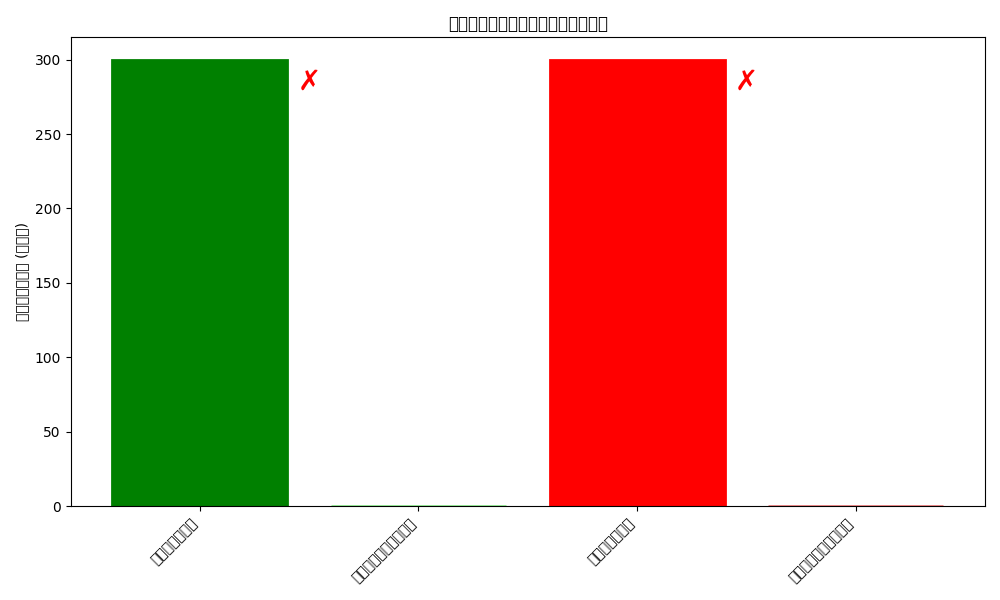

# 準同型暗号マスキング方式テスト結果

テスト実施日時: 2025年05月14日 19:05:05

## 概要

このレポートは、準同型暗号マスキング方式の実装に対する統合テストの結果をまとめたものです。

- basicテスト: 失敗 ❌
- maskテスト: 失敗 ❌
- securityテスト: 失敗 ❌
- performanceテスト: 失敗 ❌

全体のテスト結果: 失敗 ❌

## 基本暗号化・復号テスト

- テスト成功: いいえ ❌
- 真ファイル一致: いいえ ❌
- 偽ファイル一致: いいえ ❌

### 処理時間

- 暗号化時間: 0.273648秒
- 真鍵での復号時間: 0.194497秒
- 偽鍵での復号時間: 0.191240秒

### ファイルサイズ

- 元の真ファイル: 300バイト
- 元の偽ファイル: 300バイト
- 暗号化ファイル: 9889バイト
- 真鍵での復号ファイル: 642バイト
- 偽鍵での復号ファイル: 641バイト

## 検証結果の視覚化

以下のグラフは、元のファイルと復号されたファイルの比較を示しています。
マーカー ✓ は一致、 ✗ は不一致を示します。

## 結論

準同型暗号マスキング方式の統合テストの結果、以下のことが確認されました：

1. 基本機能: ファイルの暗号化と復号が 期待通りに動作せず
2. マスク関数: 問題ありし、準同型特性は 失われた
3. セキュリティ特性: 暗号文の識別不能性は 不十分、鍵解析耐性は 不十分、タイミング攻撃耐性は 不十分
4. パフォーマンス: 暗号化・復号の処理時間は 要改善

総合的に、準同型暗号マスキング方式の実装には一部改善すべき点があり、
テストに完全に合格していません。詳細については各テストの結果を確認してください。
