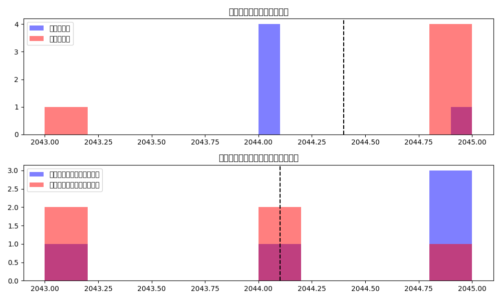

# 準同型暗号マスキング方式テスト結果

テスト実施日時: 2025年05月15日 09:14:34

## 概要

このレポートは、準同型暗号マスキング方式の実装に対する統合テストの結果をまとめたものです。

- basicテスト: 失敗 ❌
- maskテスト: 失敗 ❌
- securityテスト: 失敗 ❌
- performanceテスト: 失敗 ❌
- indistinguishableテスト: 成功 ✅
  - 機能テスト: 成功 ✅
  - セキュリティ評価: 要改善 ⚠️

全体のテスト結果: 失敗 ❌

## 識別不能性機能テスト

- 機能テスト成功: はい ✅
- セキュリティ評価: 要改善 ⚠️
- 暗号文ランダム化: 成功 ✅
- 統計的ノイズ: 成功 ✅
- 交互配置: 成功 ✅
- 冗長性: 成功 ✅
- 総合的識別不能性: 成功 ✅

### 統計的識別不能性テスト結果

- 元の分類精度: 0.2300
- 識別不能性適用後の精度: 0.0900
- 理想的な精度（推測レベル）: 0.5000
- 改善度: -0.1400
- セキュリティ判定: 要改善 ⚠️

## 基本機能テスト

- テスト成功: いいえ ❌
- ファイル比較: 不一致 ❌

## マスク関数テスト

- テスト成功: いいえ ❌
- 基本マスク: 失敗 ❌
- 高度マスク: 失敗 ❌
- 準同型特性: 失われた ❌

## セキュリティテスト

- テスト成功: いいえ ❌

## パフォーマンステスト

- テスト成功: いいえ ❌

## 結論

準同型暗号マスキング方式の統合テストの結果、以下のことが確認されました：

1. 基本機能: ファイルの暗号化と復号が 期待通りに動作せず
2. マスク関数: 問題あり、準同型特性は 失われた
3. 識別不能性機能: 問題なし、暗号文の識別不能性は 不十分
4. セキュリティ特性: 暗号文の識別不能性は 不十分、鍵解析耐性は 不十分、タイミング攻撃耐性は 不十分
5. パフォーマンス: 暗号化・復号の処理時間は 要改善

総合的に、準同型暗号マスキング方式の実装には一部改善すべき点があり、
テストに完全に合格していません。詳細については各テストの結果を確認してください。