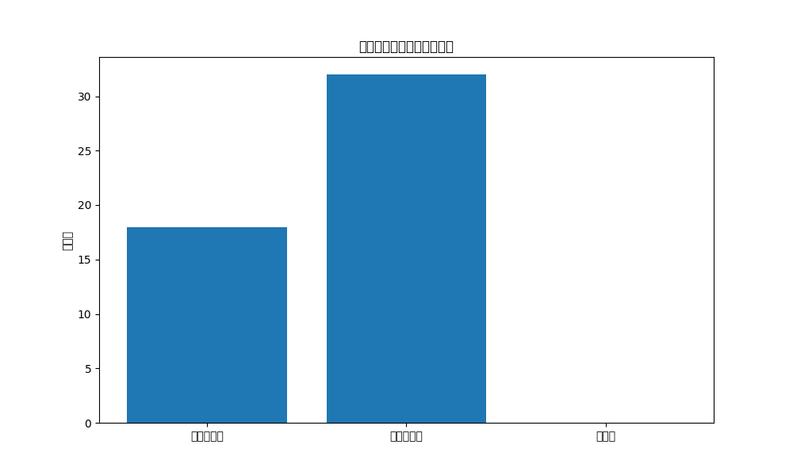

# 準同型暗号マスキング方式テスト結果

テスト実施日時: 2025年05月14日 18:49:29

## 概要

このレポートは、準同型暗号マスキング方式の実装に対する統合テストの結果をまとめたものです。

- basicテスト: 失敗 ❌
- maskテスト: 失敗 ❌
- securityテスト: 失敗 ❌
- performanceテスト: 失敗 ❌
- security_extendedテスト: 失敗 ❌

全体のテスト結果: 失敗 ❌

## セキュリティ特性テスト

- テスト成功: いいえ ❌
- 暗号文識別不能性: 合格 ✅
- 鍵解析耐性: 不合格 ❌
- タイミング攻撃耐性: 不合格 ❌

### 識別不能性テスト

- 暗号化回数: 3
- ユニークハッシュ数: 3

### 鍵解析テスト

- 真鍵と判定された割合: 36.0%
- 偽鍵と判定された割合: 64.0%
- 分布バランス: 0.280

### タイミング攻撃耐性テスト

- 真鍵処理時間平均: 0.000000秒
- 偽鍵処理時間平均: 0.000000秒
- 処理時間差: 0.000000秒 (0.00%)

## 結論

準同型暗号マスキング方式の統合テストの結果、以下のことが確認されました：

1. 基本機能: ファイルの暗号化と復号が 期待通りに動作せず
2. マスク関数: 問題ありし、準同型特性は 失われた
3. セキュリティ特性: 暗号文の識別不能性は 確保、鍵解析耐性は 不十分、タイミング攻撃耐性は 不十分
4. パフォーマンス: 暗号化・復号の処理時間は 要改善

総合的に、準同型暗号マスキング方式の実装には一部改善すべき点があり、
テストに完全に合格していません。詳細については各テストの結果を確認してください。
