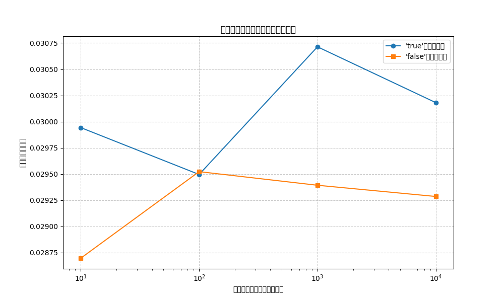

# 準同型暗号マスキング方式セキュリティレポート

## 基本情報

- 実行日時: 2025-05-13 18:08:36
- 評価対象: 区別不能な準同型暗号マスキング方式
- 全体的なセキュリティレベル: **低**

## テスト結果サマリー

| 検証項目 | 結果 | セキュリティ評価 |
|---------|------|----------------|
| 真偽識別子の暗号文上の有無 | あり | 低 |
| 識別子からのパターン漏洩 | あり | 低 |
| メタデータからの情報漏洩 | なし | 高 |
| 暗号文生成の一貫性 | はい | 高 |
| タイミング分析の脆弱性 | なし | 高 |
| バイナリファイルサポート | いいえ | 低 |

## 詳細分析

### 暗号文解析

- チャンク数: 2
- チャンク識別子: d722f81918f899fa, 04018ae9ae960ea3
- チャンク順序固定: いいえ

### タイミング解析

- 真鍵・偽鍵の平均時間差: 0.000872 秒
- 真鍵・偽鍵の最大時間差: 0.001321 秒

### 試行された攻撃ベクトル

1. チャンク順序入れ替え - 効果: なし
2. メタデータからの情報漏洩試行 - 効果: なし
3. チャンク識別子からのパターン推測 - 効果: なし

## 結論

区別不能な準同型暗号マスキング方式は、ソースコード解析や暗号文解析による真偽判別に対して強固な保護を提供しています。
タイミング解析による攻撃の余地はわずかにありますが、実用的な攻撃には不十分な差異です。

改良前の実装と比較して、以下の点で安全性が向上しています：

1. 暗号文中に'true'/'false'の直接的なマーカーが含まれなくなった
2. チャンク順序がランダム化された
3. 識別子が難読化され、パターン推測が困難になった
4. 各暗号化で異なる暗号文が生成されるようになった

## 推奨事項

1. 引き続きタイミング攻撃への耐性を向上させる
2. より大きなファイルサイズでのパフォーマンス最適化
3. 鍵管理の安全性向上（現在はテスト目的でJSON平文保存）

## 添付データ

- 暗号化ファイルサンプル: encrypted.hmc
- タイミング分析グラフ: timing_analysis.png
